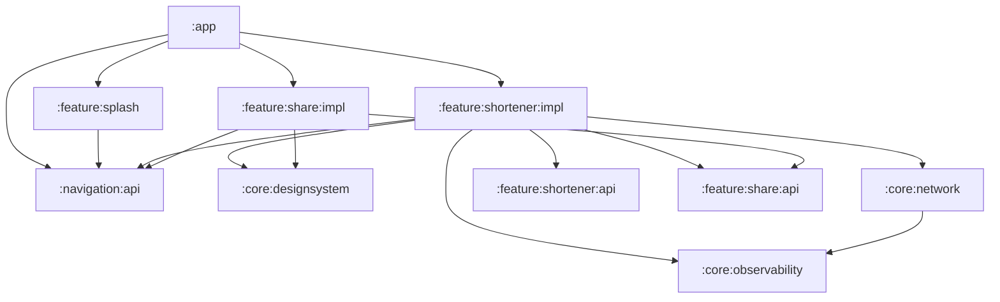
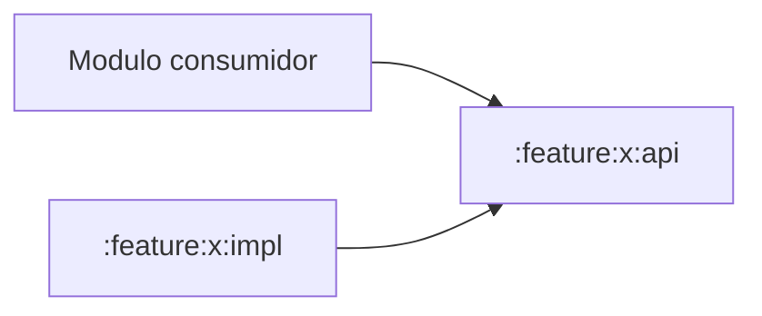
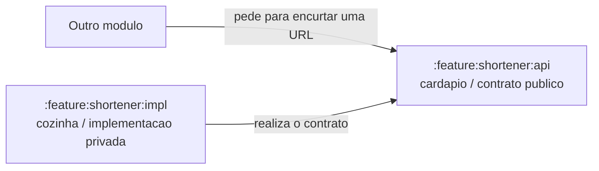
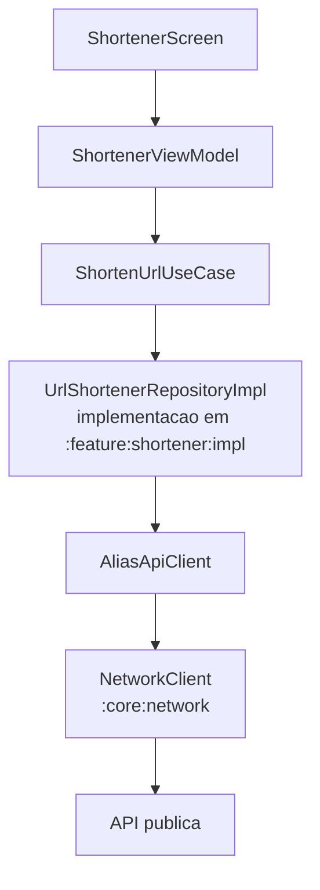
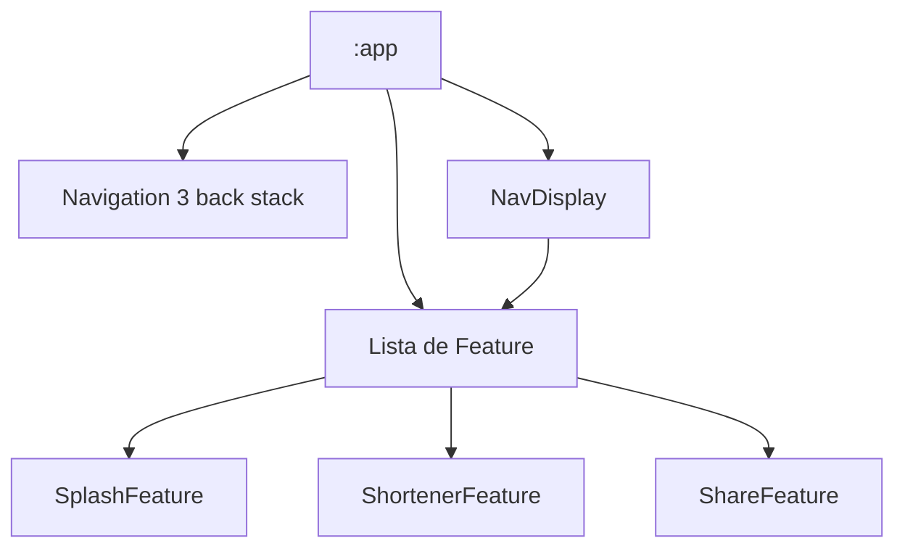
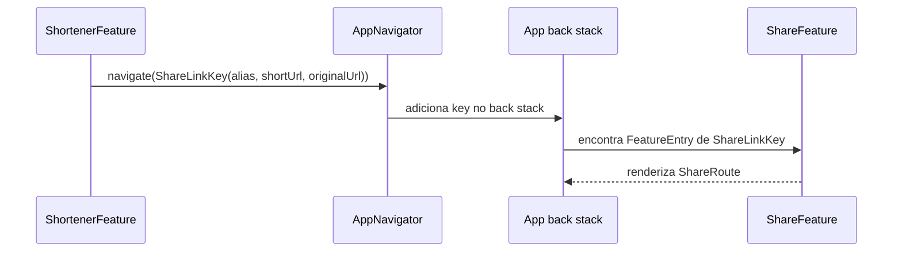

# Shortener

App Android simples para encurtar URLs.

## O que o app faz

1. Recebe uma URL, como `example.com`.
2. Ajusta para um formato valido, como `https://example.com`.
3. Envia a URL para a API.
4. Mostra o alias gerado na lista de links recentes.
5. Permite compartilhar o link retornado pela API.
6. Permite abrir a URL original que ja veio na resposta.
7. Permite copiar o link curto na tela de compartilhamento.
8. Mostra erro amigavel quando a URL e invalida ou quando a API falha.

A API usada para encurtar e:

```text
https://url-shortener-server.onrender.com/api/alias
```

Observacao: a API gera um alias curto, mas o dominio publico da API é longo. Por isso o link completo retornado pela API pode ficar maior do que algumas URLs originais.

O que e curto no retorno e o alias:

```text
609299506
```

No app, o botao **Abrir URL** abre a URL original que ja veio na resposta do encurtamento.

## Como rodar o projeto

### Requisitos

- Android Studio recente;
- JDK 17;
- Android SDK instalado;
- device fisico ou emulador com internet.

O projeto usa Gradle Wrapper, entao nao precisa instalar Gradle manualmente.

### Pelo Android Studio

1. Descompacte o `.zip`.
2. Abra a pasta do projeto no Android Studio.
3. Aguarde o Gradle Sync terminar.
4. Selecione a configuracao `app`.
5. Escolha um device fisico ou emulador.
6. Clique em **Run**.

### Pelo terminal

Gerar o APK debug:

```bash
./gradlew :app:assembleDebug
```

Instalar no device conectado:

```bash
./gradlew :app:installDebug
```

Rodar os testes unitarios principais:

```bash
./gradlew :core:observability:test :feature:shortener:impl:testDebugUnitTest
```

Rodar a validacao principal:

```bash
./gradlew :app:assembleDebug :core:observability:test :feature:shortener:impl:testDebugUnitTest :app:assembleDebugAndroidTest
```

### Sentry opcional

O app roda sem configurar Sentry.

Se quiser testar envio para Sentry, crie um arquivo `local.properties` na raiz do projeto e adicione:

```properties
SENTRY_DSN=https://seu-dsn@sentry.io/projeto
```

Esse arquivo nao deve ser enviado junto com credenciais reais.

### Observacao sobre a API

O app usa uma API publica hospedada no Render. Em alguns momentos ela pode demorar para responder por cold start. Quando isso acontece, o app mostra uma mensagem amigavel de erro.

## Arquitetura

O projeto usa Single Activity, Jetpack Compose, Navigation 3, MVVM com `StateFlow`, Koin, Ktor e modulos separados por responsabilidade.

Na camada de apresentação, estou utilizando MVVM:

- a View é a tela em Compose;
- o ViewModel recebe as ações do usuário;
- o ViewModel chama os use cases;
- o estado da tela fica em um `ShortenerUiState`;
- a tela observa esse estado e se redesenha.

### Visao geral



A ideia é simples:

- `:app` monta o aplicativo final.
- `:core:*` concentra coisas reutilizaveis do app inteiro.
- `:navigation:api` define o contrato de navegação.
- `:feature:*:api` expõe contratos pequenos e estáveis.
- `:feature:*:impl` guarda a implementação real da feature.

### Modulos atuais

```text
:app
:core:designsystem
:core:network
:core:observability
:navigation:api
:feature:splash
:feature:share:api
:feature:share:impl
:feature:shortener:api
:feature:shortener:impl
```

Hoje a divisao é:

- modulos Android: `:app`, `:core:designsystem`, `:navigation:api`, `:feature:splash`, `:feature:share:api`, `:feature:share:impl`, `:feature:shortener:impl`;
- modulos Kotlin puros: `:core:observability`, `:core:network`, `:feature:shortener:api`.

## Padrao API / Impl

As features que podem ser consumidas por outras partes do app seguem o padrao `api` e `impl`.



O modulo `api` é o contrato. Ele deve ter pouca coisa:

- interfaces que outros modulos podem usar;
- modelos que atravessam a fronteira da feature;
- keys de navegacao quando outra feature precisa abrir uma tela com parametros.

O modulo `impl` é a implementacao privada. Ele pode ter:

- telas em Compose;
- ViewModel;
- use cases;
- repositories concretos;
- clients remotos;
- DI;
- dependencias como Ktor, Koin, Compose e design system.

Um jeito simples de pensar:

```text
api = o que posso pedir
impl = como isso é feito
```

Exemplo do dia a dia:

```text
Restaurante
api: o cardapio.
impl: a cozinha.
```

Voce so precisa saber que existe "hamburguer com batata" no cardapio. Voce nao precisa saber qual panela usam, quem corta a batata ou como organizam a cozinha.

Na pratica, isso evita que uma feature precise conhecer a tela, o ViewModel ou a chamada de rede de outra feature.

### Exemplo de API / Impl no Shortener



No `:feature:shortener:api` ficam as coisas que outros modulos podem conhecer:

- `Shortener`;
- `ShortenUrlResult`;
- `ShortenedUrl`;
- `ShortenerError`.

No `:feature:shortener:impl` fica como isso funciona por dentro:

- tela;
- ViewModel;
- use case;
- implementacao concreta do repository;
- client da API;
- DI.

### Fluxo interno do Shortener

Depois que estamos dentro do `impl`, o fluxo segue a separacao normal da feature:



O use case chama a capacidade de encurtar que o `impl` injeta nele.

A implementacao concreta `UrlShortenerRepositoryImpl` fica dentro do `impl` e usa `AliasApiClient` para chamar a API.

## Navegacao entre modulos

A navegacao usa Navigation 3, mas as features nao mexem diretamente no back stack. O back stack fica no `:app`.

O modulo `:navigation:api` define tres pecas:

```kotlin
interface AppNavKey
interface AppNavigator
interface Feature
```

Cada feature registra as telas que sabe renderizar usando `FeatureEntry`.



O `:app` faz quatro coisas:

- cria o back stack com `rememberNavBackStack(SplashKey)`;
- cria o `AppNavigator` concreto;
- junta as features em uma lista;
- entrega a key atual para a feature que sabe renderizar aquela tela.

As features fazem duas coisas:

- declaram suas proprias keys;
- dizem qual tela deve ser renderizada para cada key.

### Navegacao com parametros

Quando a tela de links recentes chama `Compartilhar`, a feature de shortener navega usando uma key publica da feature de share:



O ponto importante: `:feature:shortener:impl` depende de `:feature:share:api`, não de `:feature:share:impl`.

Isso permite chamar a tela de compartilhamento sem conhecer a implementacao dela.

## Modulos

### `:app`

Entrada do aplicativo.

Responsável por:

- abrir a `MainActivity`;
- aplicar o tema;
- iniciar o Koin;
- configurar o Sentry quando existir DSN;
- manter o back stack do Navigation 3;
- renderizar as telas com `NavDisplay`;
- orquestrar a troca entre features.

### `:navigation:api`

Contrato de navegacao usado entre `:app` e features.

Aqui ficam:

- interface `AppNavKey`;
- interface `AppNavigator`;
- interface `Feature`;
- nenhum detalhe de tela, ViewModel, rede ou regra de negocio.

### `:feature:splash`

Feature da splash.

Aqui ficam:

- tela de abertura;
- key de navegacao `SplashKey`;
- feature de navegacao `SplashFeature`;
- textos da splash;
- tempo de exibicao;
- callback para avisar que a navegacao pode continuar.

### `:feature:shortener:api`

Contrato publico da feature de encurtador.

Aqui ficam:

- interface publica `Shortener`;
- resultado publico `ShortenUrlResult`;
- modelos publicos `ShortenedUrl` e `ShortenerError`;
- nenhum detalhe de Compose, Android, Ktor, ViewModel ou regra interna.

Esse modulo deve continuar leve e estavel. Ele nao tem Manifest, resources, Compose ou dependencia Android.

### `:feature:share:api`

Contrato publico da feature de compartilhamento.

Aqui ficam:

- key parametrizada `ShareLinkKey`;
- dados necessarios para compartilhar um link: alias, URL curta e URL original;
- nenhum detalhe de tela, intent Android ou design system.

### `:feature:share:impl`

Implementacao privada da feature de compartilhamento.

Aqui ficam:

- tela em Compose para revisar o link antes de compartilhar;
- acao para copiar a URL curta;
- acao para abrir o share sheet nativo do Android;
- feature de navegacao `ShareFeature`.

### `:feature:shortener:impl`

Implementacao privada da feature de encurtador.

Aqui ficam:

- tela em Compose;
- `ShortenerViewModel`;
- estado da tela com `StateFlow`;
- mensagens que aparecem para o usuario;
- use case de encurtamento;
- regras de validacao e normalizacao da URL;
- implementacao concreta do repository;
- client remoto da API;
- key de navegacao `ShortenerKey`;
- navegacao para `ShareLinkKey` usando apenas o contrato publico de `:feature:share:api`;
- registrador de navegacao da feature;
- DI interno da feature.

Outros modulos que precisarem da capacidade de encurtar URL devem enxergar apenas o contrato do `:feature:shortener:api`. A tela concreta e a entrada de navegacao ficam no `impl`.

Dentro do `impl`, a feature continua organizada em partes menores:

```text
ui: tela, estado e ViewModel
usecase: regra de encurtamento
repository: implementacao que transforma resposta remota em modelo do app
remote: request, response e chamada HTTP da API
```

### `:core:network`

Configuração de rede.

Centraliza:

- base URL;
- timeouts;
- cliente Ktor;
- engine OkHttp;
- serializacao JSON;
- logs completos de request e response;
- erros de rede.

### `:core:designsystem`

Componentes visuais reutilizaveis.

Aqui ficam:

- tema;
- cores;
- tipografia;
- componentes;

### `:core:observability`

Logs e provedores de observabilidade.

O app usa `AppLogger` nas features. Esse contrato não conhece Sentry, Datadog ou New Relic.

Dentro do modulo, o log vira um `LogEvent` com:

- nivel;
- mensagem;
- erro opcional;
- atributos simples, como `alias`, `path` ou `errorType`.

Depois o `CompositeAppLogger` envia esse evento para destinos configurados.

Hoje existem:

- `ConsoleReport`: escreve logs no console com a tag `AppLogs`;
- `SentryReport`: envia breadcrumbs e erros para o Sentry.

Se amanha precisarmos trocar ou adicionar New Relic/Datadog, a ideia é criar outro report de log e trocar a configuracão no Koin:

```kotlin
CompositeAppLogger(
    reports = listOf(
        ConsoleReport(),
        SentryReport(),
    ),
)
```

A inicializacao Android do Sentry fica no `:app`. O DSN entra por `local.properties` ou variável de ambiente.

## Fluxo

Quando entra:


```text
App
  -> NavDisplay
  -> Splash
  -> Shortener
      -> Screen
      -> ViewModel
      -> UseCase
      -> Repository
      -> AliasApiClient
      -> Network
      -> API
```

Quando volta:

```text
API funcionou
  -> mapeia resposta para ShortenedUrl
  -> adiciona no historico
  -> mostra mensagem de sucesso

API falhou
  -> mostra mensagem amigável

URL invalida
  -> nao chama a API
  -> mostra mensagem amigavel
```

## Bibliotecas utilizadas nesse app

- Jetpack Compose: telas.
- Navigation 3: back stack e renderizacao das telas.
- Material 3: base visual.
- Koin: injecao de dependencias e ViewModel.
- Ktor: chamadas HTTP.
- OkHttp: engine do Ktor.
- Kotlinx Serialization: JSON.
- Sentry: observabilidade.
- JUnit: testes unitarios.
- Turbine: testes de `StateFlow` no ViewModel.
- Compose UI Test: teste instrumentado basico da tela.
- Maestro: testes E2E/UI por YAML.

## Sentry

O DSN do Sentry nao fica no codigo.

Configure no `local.properties`:

```properties
SENTRY_DSN=https://seu-dsn@sentry.io/projeto
```

Ou por variavel de ambiente:

```bash
export SENTRY_DSN="https://seu-dsn@sentry.io/projeto"
```

Se o DSN estiver vazio, o app nao inicia o Sentry.

## Testes

### Unitarios de observability

Arquivo:

```text
core/observability/src/test/java/.../CompositeAppLoggerTest.kt
```

Cobre:

- log de info enviado para todos os destinos;
- log de erro mantendo `Throwable` e atributos;
- falha em um destino sem impedir envio para os outros destinos.

Rodar:

```bash
./gradlew :core:observability:test
```

### Unitarios da regra de negocio

Arquivo:

```text
feature/shortener/impl/src/test/java/.../ShortenUrlUseCaseTest.kt
```

Cobre:

- URL sem `https://` e normalizada antes de chamar o repository;
- falha do repository retornando `ServiceUnavailable`;
- URL invalida sem chamar o repository.

Rodar:

```bash
./gradlew :feature:shortener:impl:testDebugUnitTest
```

### Unitarios de dados

Arquivo:

```text
feature/shortener/impl/src/test/java/.../UrlShortenerRepositoryImplTest.kt
```

Cobre:

- sucesso remoto mapeando `AliasResponse` para `ShortenedUrl`;
- falha remota retornando `Result.failure`;
- `_links.self` virando `originalUrl`;
- `_links.short` virando `shortUrl`;
- chamada ao logger quando existe erro remoto.

Rodar:

```bash
./gradlew :feature:shortener:impl:testDebugUnitTest
```

### Unitarios de ViewModel

Arquivo:

```text
feature/shortener/impl/src/test/java/.../ShortenerViewModelTest.kt
```

Usa Turbine para observar o `StateFlow`.

Cobre:

- sucesso ao encurtar, com loading, historico e mensagem;
- falha do repository mostrando mensagem de indisponibilidade;
- URL invalida sem chamar repository;
- abrir URL usando a URL original ja disponivel no estado.

Rodar:

```bash
./gradlew :feature:shortener:impl:testDebugUnitTest
```

### Teste instrumentado

Arquivo:

```text
app/src/androidTest/java/.../MainActivityTest.kt
```

Cobre:

- app abre;
- splash termina;
- tela principal aparece;
- titulo e secao de links recentes aparecem.

Gerar APK de teste:

```bash
./gradlew :app:assembleDebugAndroidTest
```

### Maestro

Flows:

```text
.maestro/launch_screen.yaml
.maestro/empty_url_error.yaml
.maestro/invalid_url_error.yaml
.maestro/shorten_success_real_api.yaml
```

Cobre:

- tela inicial depois da splash;
- estado vazio;
- erro de URL vazia;
- erro de URL invalida;
- smoke de sucesso com API real.

O flow `shorten_success_real_api.yaml` depende da API real e pode falhar se a API estiver fria, lenta ou fora.

Instalar o app debug:

```bash
./gradlew :app:installDebug
```

Rodar flows estaveis:

```bash
maestro test .maestro/launch_screen.yaml
maestro test .maestro/empty_url_error.yaml
maestro test .maestro/invalid_url_error.yaml
```

Rodar o smoke com API real:

```bash
maestro test .maestro/shorten_success_real_api.yaml
```

## Comandos principais

Gerar o app:

```bash
./gradlew :app:assembleDebug
```

Rodar todos os testes unitarios atuais:

```bash
./gradlew :core:observability:test :feature:shortener:impl:testDebugUnitTest
```

Rodar validacao principal:

```bash
./gradlew :app:assembleDebug :core:observability:test :feature:shortener:impl:testDebugUnitTest :app:assembleDebugAndroidTest
```

Rodar lint:

```bash
./gradlew lintDebug
```

## Guards do projeto

- Texto visivel para o usuario fica em `strings.xml`.
- Texto tecnico de log pode ficar no codigo.
- Componentes visuais compartilhados ficam no `:core:designsystem`.
- Configuracao de rede fica no `:core:network`.
- Logs e Sentry ficam no `:core:observability`.
- Contrato de navegacao fica no `:navigation:api`.
- Cada feature declara as proprias keys de navegacao.
- O `:app` mantem o back stack e orquestra fluxo entre features.
- Contrato publico de feature fica em `:feature:*:api`.
- Implementacao privada de feature fica em `:feature:*:impl`.
- Dentro do `impl`, regra, dados e tela continuam separados por package.
- Testes seguem o padrao Given, When, Then.
